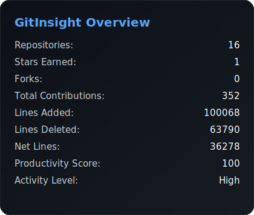
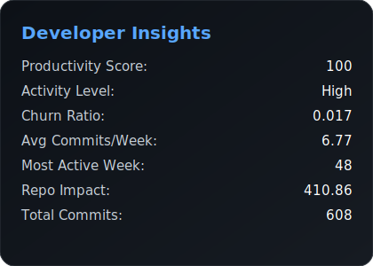
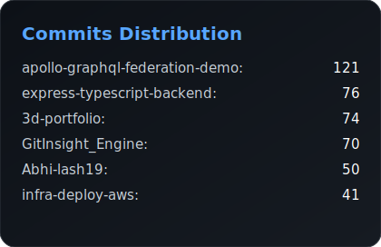

# GitInsight Engine

A modular, high-performance GitHub analytics engine that aggregates repository and user insights using REST and GraphQL APIs, with intelligent caching, conditional requests, and extensible stat pipelines.

---

# Overview

**GitInsight Engine** is designed to fetch, compute, and export advanced GitHub metrics for dashboards, badges, analytics pipelines, and developer insights platforms.

It focuses on:

* ⚡ Performance via multi-layer caching
* 📊 Rich analytics (traffic, commits, languages, code frequency)
* 🧩 Modular service architecture
* 🔄 Backward-compatible outputs
* 🧪 Deterministic CLI workflows

---

# Key Features

## Data Collection

* Repository metadata
* Commit activity & contribution stats
* Code frequency analytics
* Language distribution
* Traffic metrics (views & clones)
* Advanced derived stats

## Performance & Reliability

* ETag conditional requests (API quota optimization)
* Per-repository caching with TTL
* Graceful fallbacks for permission-restricted endpoints
* Observability via request timing logs

## Output & Compatibility

* Versioned JSON output
* Deterministic schema
* SVG/CLI compatibility preserved
* Extensible stat pipeline

---

# Architecture

## High-Level Flow

1. CLI / consumer triggers stats generation
2. Core orchestrator resolves repositories
3. Services fetch & compute metrics
4. Cache layer intercepts API calls
5. Output formatter wraps with metadata
6. JSON/SVG exported

---

## Core Modules

### 1. Core Layer

Responsible for orchestration and execution lifecycle.

**Responsibilities**

* Pipeline coordination
* Service composition
* Error boundaries
* Output assembly

---

### 2. Service Layer

#### advancedStatsService

Aggregates higher-order metrics derived from multiple endpoints.

#### codeFrequencyService

Processes additions/deletions time-series data.

#### languageService

Fetches and normalizes language distribution.

#### trafficService

Retrieves views/clones and handles permission fallbacks.

---

### 3. Cache Layer

Two-tier caching strategy:

#### HTTP Cache (ETag)

* Stores ETag headers
* Sends conditional requests
* Avoids unnecessary API calls

#### Repo Cache

```
output/
  repo-cache/
    <repo>/
      commit-activity.json
      code-frequency.json
      languages.json
```

**Features**

* TTL validation
* Automatic invalidation
* Transparent to services

---

### 4. Output Layer

All outputs are wrapped with metadata:

```json
{
  "version": "x.y.z",
  "generatedAt": "ISO timestamp",
  "data": { ...stats }
}
```

---

# Data Pipeline

## Step 1 — Repository Discovery

Determines target repos from config/CLI.

## Step 2 — Fetch Phase

Services request GitHub APIs with caching + ETag.

## Step 3 — Compute Phase

Derived metrics calculated (ratios, trends, aggregates).

## Step 4 — Normalize

Ensures stable schema across runs.

## Step 5 — Export

JSON + optional SVG.

---

# Configuration

Typical configuration inputs:

* GitHub token
* Cache TTL
* Output directory
* Repo filters
* Feature flags

Environment variables are recommended for secrets.

---

# Extensibility

GitInsight Engine is designed to be extended via new services.

## Add a New Metric

1. Create a service module
2. Register in stats pipeline
3. Add cache strategy (optional)
4. Extend output schema
5. Write tests

---

# Observability

Built-in logging provides:

* Request durations
* Cache hits/misses
* Fallback triggers
* Service execution timing

This makes it suitable for CI and scheduled analytics jobs.

---

# Error Handling Strategy

* Network failures → retried or cached fallback
* Permission errors → soft-fail with partial data
* Schema safety → default values injected
* Service isolation → failure does not break pipeline

---

# Determinism & Reproducibility

The engine ensures:

* Stable ordering
* Versioned outputs
* Cache-aware repeatability
* Consistent numeric rounding

---

# Use Cases

* GitHub profile analytics dashboards
* Developer productivity insights
* OSS health monitoring
* Automated README badges
* Internal engineering metrics pipelines

---

# CLI Workflow (Conceptual)

```
gitinsight generate --user <username>
gitinsight generate --repo <owner/name>
gitinsight export --format svg
```

---

# Design Principles

1. **Modularity over monoliths**
2. **Cache aggressively, fetch minimally**
3. **Schema stability is critical**
4. **Fail soft, not loud**
5. **Composable stat services**
6. **Backward compatibility first**

---

# Roadmap Ideas

* GraphQL batching
* Incremental updates
* Plugin ecosystem
* Real-time streaming stats
* Web dashboard
* Multi-user aggregation

---

# ⭐ Why GitInsight Engine?

Because GitHub analytics should be:

* Fast
* Deterministic
* Extensible
* CI-friendly
* Developer-centric

---

## 📊 Live GitHub Stats







